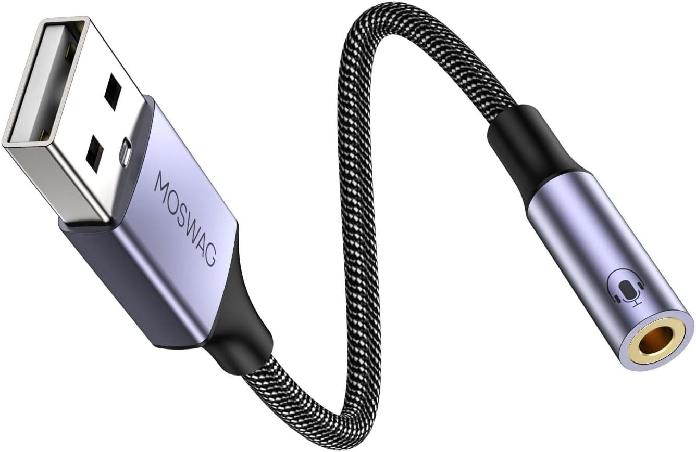
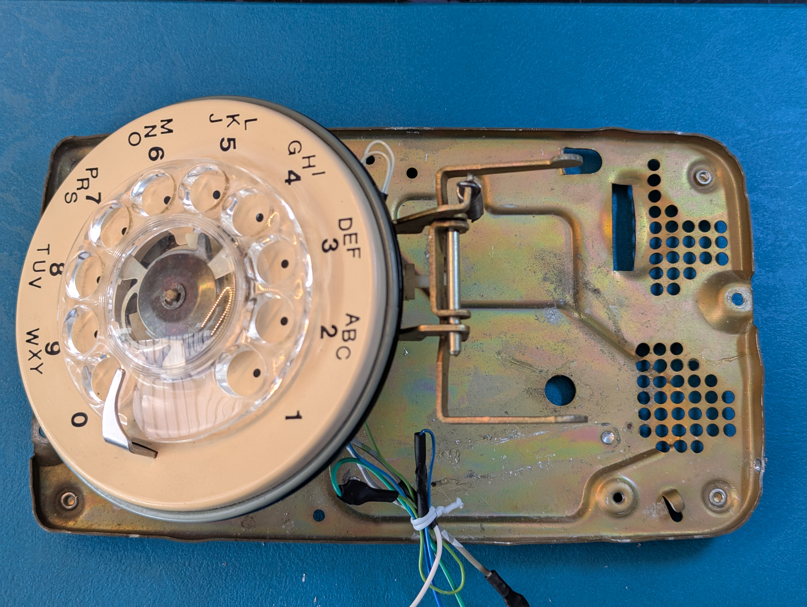
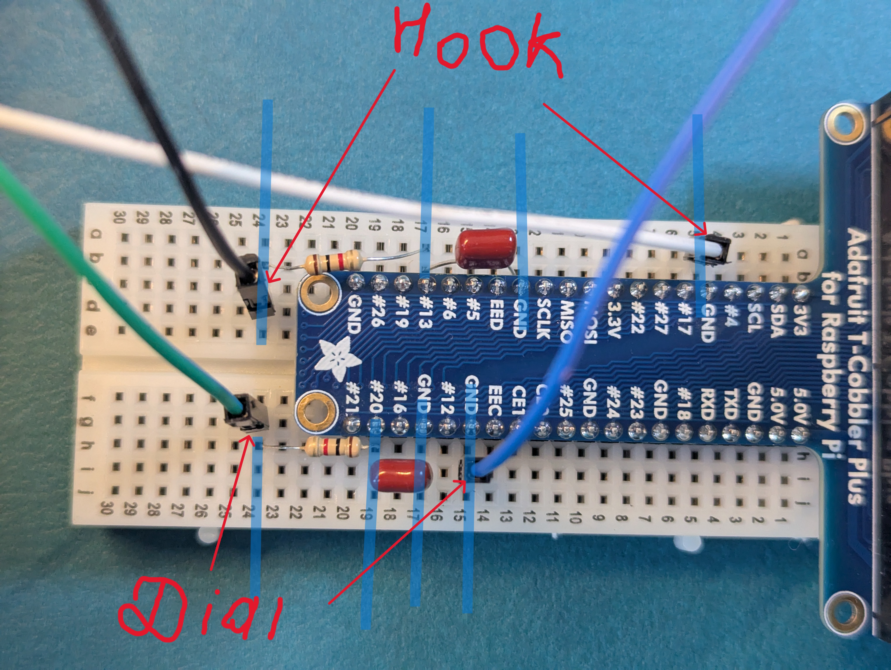

# Instructions: How to Connect a Rotary Phone to a Raspberry Pi 4B
_This is my “from-zero” logbook for turning a Northern Telecom rotary phone into a Raspberry-Pi-powered conversation device. It keeps the charm of the old hardware while steering clear of the original ring/line circuitry._

>### ⚠️Safety first
>- **We are not connecting to the public phone network.**
>- **Unplug power whenever you touch GPIO or rewire anything.**
>- **Avoid touching bare pins or the underside of the Pi while powered.**
>- **Old phones can have sticky tar/gel in the 425B block it is messy but not toxic.**
---

### Parts List
- Rotary Phone Northern Telecom
- Raspberry Pi 4B Starter Kit with 4 GB <br> 
<br>
  - I picked a Raspberry Pi 4B Starter Kit because it’s perfect for first-timers (me). It included:
    - Pi 4B (4 GB RAM)
    - Case
    - 5.1V/3A USB-C power supply
    - 32 GB microSD with Raspberry Pi OS pre-flashed
    - HDMI A→Micro-D cable
    - USB microSD reader
    - Heatsinks
    - Quick-start guide
- Assembled Pi Cobbler Plus - Breakout Cable for Raspberry Pi A+/B+/Pi 2/Pi 3
- Set of Jumper Cable - at least 10
- Resistor 1K OHM 1/4W 5% AXIAL - you will need 2, take pack of 10 they are less then 2 CAD
- Capacitors 0.1 µF (x2) — I used polypropylene film (ceramic is fine)
- Half-size 400-Pin DIY Breadboard
- USB external sound card audio adapter - USB to Audio Jack Adapter <br>

- Erbuds with mic and jack

Tools (what I actually used):
- Digital Multimeter<br>

- Screwdriver, nippers, pliers, small multitool (for cleaning wire ends)

- Heat Shrink Pack + lighter
- Zip ties
- Mounting tape
- Drill + bits
- Tape
- Play-Doh (yes, your kids 'modeling compound' -)
- Nice-to-have (I didn’t have them this time): Alligator Clip Multimeter Leads<br>


## Step 1 — Prepare the phone
 <br>
- Remove the shell and get familiar with the mechanics—how the **cradle (hook switch)** works and how the **rotary dial** returns. Grab the multimeter and poke around (in continuity/beep mode). 
- Use the NET 425B block as a map to trace wiring. We need:
    - **Two wires from the dial** (the pulse contacts)
    - **Two wires from the hook switch** (cradle)
- Remove the handset - unscrew the wiring for the handset cord or cut them.
- You can **remove the ringer (bells) module** if you’re not planning to make the phone ring. If you want incoming-call effects later, leave it
 <br>
- Unscrew the dial, get familiar with the construction, see the mechanics how it works. You’ll usually find 4 wires:
    - 2 wires = dial pulses (open/close while the dial returns)
    - 2 wires = “mic mute” while dialing (prevents noise)
    - We only need the pulse pair. Colors vary (mine were blue/green).
- How to identify the pulse pair with a multimeter:
    - Put the meter in continuity (beep) mode. Touch one probe to each candidate pair. Dial a number and let the dial return slowly. You should hear beep bursts that match the digit you dialed (e.g., “3” → three bursts).
     >If your meter can’t keep up (mine couldn’t), hold the dial at the end of the rotation >and manually let it return slowly with your hand—you’ll hear the bursts. This is where >alligator clips really help—I wish I had them.<br>
- Mark the pulse pair. The other two (mic-mute) can be isolated and taped out of the way for future experiments (e.g., fake “dialing” click sound).<br>
 <br>
- **Find the cradle (hook) pair:** Trace the two leads from the hook switch to the NET 425B. With the multimeter, you should see:
  - On cradle: open circuit (no beep)
  - Lifted: closed (long beep)<br>
Mark these two.
- Now we can remove the NET 425B block to give more room for the Pi and breadboard. Disconnect all the wires from the block. The block itself is full of sticky wax/goop inside. I tried to pull it apart and made a mess (WD-40 + dish soap cleaned my hands). What finally worked was drilling out the two bottom pins and popping it free. If you can, just drill it from the back and avoid the goo entirely.
- You should now have a clean base with:
   - 2 wires from the cradle that we need (dont cut other wires - we will cut them after connecting and be sure that we got the right pair)
   - 2 wires from the dial pulse contacts<br>
    <br>


### Step 2 — Prepare the Raspberry Pi
 <br>
- Download Raspberry Pi Imager - https://www.raspberrypi.com/software/ <br>
- Here i the clear [Getting Started](https://www.raspberrypi.com/documentation/computers/getting-started.html) instruction with all the required steps and how to [Install an operation system](https://www.raspberrypi.com/documentation/computers/getting-started.html#installing-the-operating-system) and setup the WiFi connection.
- In Imager, set:
  - Hostname, username/password
  - Enable SSH
  - Wi-Fi SSID/password (if you’re not using Ethernet)<br>
>**Tip:** Unplug other USB drives or SD cards to avoid imaging the wrong device.
### First boot + SSH
1. Insert the SD, power up the Pi, give it a minute until the green LED calms down.
2. Try to SSH in:
```bash
ssh <username>@<hostname>
# or
ssh <username>@<PI_IP_ADDRESS>
```


 If you failed to connect with hostname - try Pi IP Adress to find it:  login to your wifi admin page -information can be found at the back of your wifi router, and find if the system sees your Pi as connected devices - Host name will be same as you provided during installation. and there you can find Ip Address. Here is detailed [Configuration on first boot](https://www.raspberrypi.com/documentation/computers/getting-started.html#configuration-on-first-boot) instructions with troubleshooting. If its not there, First try to unplug and plug back you Pi, wait a minute till the green light stop blinking on the Pi and try again, if still no go - i recommended to reinstall operation system once again,  take out sD card - insert into your laptop and lunch Imager once again, fill up WiFi name and password with caution follow instruction after successful installation insert sD card back to Pi - power it up, give it few minutes and try terminal again, after successful connection it will ask you to type the password - and you are connected.
If still it could not connect to WiFi - use Ethernet connection if available, and check your internet Admin page once again to see the Pi connected. If still not succeeded, you can connect monitor with provided cable from the kit, connect keyboard and mouse and astr Pi and you will see operation system refer to [Configuration on first boot](https://www.raspberrypi.com/documentation/computers/getting-started.html#configuration-on-first-boot) instructions.
Cangrats! Your Pi is up and running!
**Avoid holding the board or touching GPIO pins** when the board is powered. Shorting the pins can easily damage the board, rendering it unusable.

### Step 3 wiring
- connect T Cobbler to the Pi


## For the Hook
Do this (Pi power OFF):
- White wire → GND row on the Cobbler (not the rail):
Find a T-Cobbler pin labeled GND. Put the F wire into the same 5-hole row as that GND pin (so F is directly on ground). Do not use the +/– rails for this step.
- Black wire + 1 kΩ → #13 row (- or any #number, inner rows only, ):
- Pick any empty inner row (not the rails). Put Black in one hole of that row.
- Put one leg of the 1 kΩ resistor in the same row as Black (so Black and that leg touch electrically).
- Put the other leg of the resistor in the row that lines up with #13 on the T-Cobbler (GPIO13). Make sure it’s the same side of the trench as the label.
- Capacitor 0.1 µF from #13 row → any GND row:
- One leg of the cap into the #13 row.
- The other leg into a GND row (you can use the same GND row you used for White).
```
Black ── 1kΩ ──> (row of #13)
                   |
                 0.1µF
                   |
                 (GND row)
White  ───────────────────────────────────────────────> (GND row)
```
 <br>
## For the Dial
- Blue wire into the  GND row on the Cobbler
- Choose an empty inner row (not the long +/– rails).
- Insert Green into that row.
- Insert one leg of a 1 kΩ resistor into that same row (so Green and that resistor leg are tied together).
- Find #20 (or any #number) on the Cobbler
- Bend and insert the other leg of the resistor into the row that lines up with #20 (or any #number).
- Take a 0.1 µF (“104”) capacitor.
- Put one leg in the #20 row. - or any #number
- Put the other leg in any GND row .

```
Blue ────────────────────────────────> [GND row with a T-Cobbler GND pin]

Green ──[1 kΩ]──> [#20 row on T-Cobbler]
                          │
                      [0.1 µF]
                          │
                        [GND row]
```

### What’s next
Once the hardware is solid, jump to the project [README](../README.md) for software bring-up:
- Server (FastAPI + Whisper + vLLM + Piper)
- Pi client app (dial tone, ringback, recording, posting to /converse)
- Dashboard at /ui to watch events (SSE)

I hope my instructions are clear enogh and easy to follow, if you have questions/sugestions dont hesitate to contact me via [Linkdin](https://www.linkedin.com/in/arturtereshchenko/)<br>
**Enjoy!** <br>
___
_PS: I wish I took more photos while building(_